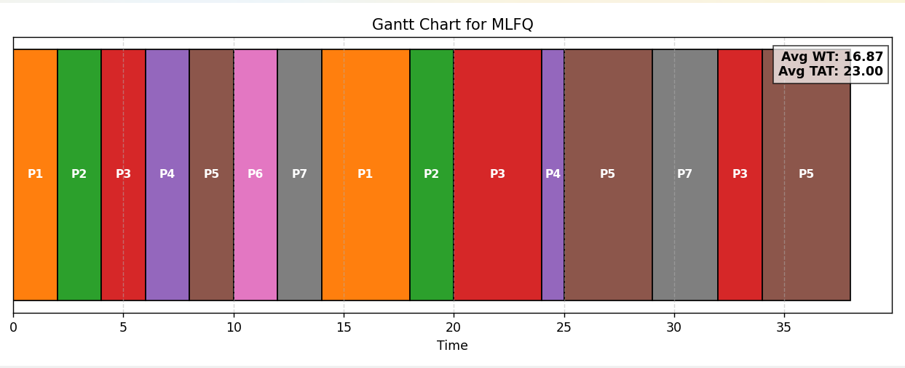

# OS Scheduler Visualizer

A **comprehensive Operating System Scheduler Visualizer** that simulates and visualizes various CPU scheduling algorithms.  

This project includes:

- **C++ implementations** of popular CPU scheduling algorithms:
  - First-Come-First-Serve (**FCFS**)  
  - Shortest Remaining Time First (**SRTF**, preemptive SJF)  
  - Round Robin (**RR**)  
  - Multi-Level Feedback Queue (**MLFQ**)  

- **Python visualization** to generate **Gantt charts** for process execution timelines and display **average waiting and turnaround times**.

---

## 🔹 Features

- Simulates scheduling for **any set of processes** with user-defined arrival and burst times.  
- Handles **preemptive and non-preemptive scheduling** algorithms.  
- Exports **results to CSV** for both process metrics and Gantt timeline.  
- **Python visualizer** produces clear Gantt charts:
  - Shows process execution timeline
  - Displays PID labels
  - Displays average **Waiting Time (WT)** and **Turnaround Time (TAT)** above the bars
- Menu-based selection to view **any algorithm's Gantt chart** interactively.

---

## 🔹 Algorithms Implemented

| Algorithm | Type | Description |
|-----------|------|-------------|
| FCFS      | Non-preemptive | Processes executed in order of arrival. |
| SRTF      | Preemptive | Process with shortest remaining burst time is selected next. |
| RR        | Preemptive | Each process gets a fixed time quantum; cycles through ready queue. |
| MLFQ      | Preemptive | Multiple queues with increasing quantum; lower priority if a process exceeds its time slice. |

---

## 🔹 Project Structure

- **SchedulerVisualizer/**
  - **cpp/** (C++ source code)
    - `main.cpp` — Main driver to run all algorithms
    - `fcfs.cpp` / `fcfs.h`
    - `sjf.cpp` / `sjf.h`
    - `rr.cpp` / `rr.h`
    - `mlfq.cpp` / `mlfq.h`
    - `scheduler.h` — Base Scheduler class and Process struct
  - **python/** (Python visualization)
    - `visualize_gantt.py` — Generates Gantt charts from CSV timelines
  - **data/** (Sample CSV outputs)
    - `output_fcfs.csv`
    - `output_sjf.csv`
    - `gantt_rr.csv`
    - `gantt_mlfq.csv`
  - `README.md`
  - `LICENSE`
---

## ⚡ How It Works

### 🧩 C++ Simulation
Each algorithm inherits from a base `Scheduler` class and implements its own `schedule()` function.  
During execution:
1. Each process’s `arrival_time`, `burst_time`, and other metrics are used.
2. Gantt chart entries are recorded (`PID`, `Start`, `End`).
3. Average Waiting Time (AWT) and Average Turnaround Time (ATAT) are calculated.
4. Results are saved in `.csv` files for visualization.

### 📊 Python Visualization
The `visualize_gantt.py` script:
- Reads the exported `.csv` files.
- Plots a horizontal **Gantt Chart** using `matplotlib`.
- Displays **Avg WT** and **Avg TAT** at the top-right corner.
- Allows you to select any algorithm from a menu and view one chart at a time.
---

## 🔹 How to Use

### 1. Compile and Run C++ Scheduler

Open terminal in the `cpp/` folder:

```bash
g++ main.cpp fcfs.cpp sjf.cpp rr.cpp mlfq.cpp -o scheduler
./scheduler
pyhon visualize_gantt.py 
```

---

## 🔹 Screenshots

### 📊 Scheduler.exe File Output


## 📊 Gantt Chart Outputs

### 1. FCFS


### 2. SRTF


### 3. RR


### 4. MLFQ


